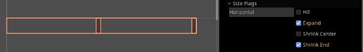

# Godot Engine 4 Basic Tricks

## Short Videos

- [Custom UI Components](https://youtu.be/JIuPwhY-3z4)
- [SVGs, anchor presets and screen alignment](https://youtu.be/EeiYtErgsBc)
- [UI Themes](https://youtu.be/3D_7qOYGGsY)
  - Currently relying on the "default theme" project setting may be problematic. Prefer setting it on root nodes as explained here: https://ask.godotengine.org/129046/problems-using-a-custom-ui-theme

## Custom UI components

It's useful to set `custom_minimum_size` by default on the template itself. This is useful for fixed-size components.

## ScrollContainer and its sizing

ScrollContainers generally have “Clip Contents” set to true.

Haledire (Discord: Haledire#9326) replied to me:

> you need to make either the margincontainer, the scrollcontainer, (likely both) to fill the container that they're in - perhaps even expand in regards to the VBoxContainer
if they don't fill out any space, they'll just shrink to nothing, because ScrollContainer does't generally take a minimum size - its direct child is supposed to be bigger than it and it's supposed to ignore that fact
these 3 nodes have to be filling their parent vertically
the label displays properly because it has an inferrable minimum size
the margin container and scrollcontainer can only fill what the vboxcontainer gives them - which they should be set to fill via size_flags - fill, margincontainer also likely needs to expand because expand is only inferred on the horizontal axis - the axis that is perpendicular to the box container

> box containers don't necessarily fill their children on the axis that flows with the container
ie:  an HBoxContainer does not expand it's children horizontally (the Horizontal Box doesn't expand Horizontally)
if they try to fill only - they don't change, because fill is meant to work in conjunction with expand on this axis, because the fill has to take other nodes into consideration
you can expand and not fill to give each child a space representative of how far it can stretch and position 'within that space'




My personal takes:

> Try setting “Layout > Container Sizing > Expand” to true wherever needed. For example, a MarginContainer and a child ScrollContainer both have “Expand” set to true.

## Timer Snippets

```gdscript
await node.get_tree().create_timer(secs).timeout
```

## Focus Snippets

```gdscript
# focus
control_node.grab_focus()
# remove focus
node.get_viewport().gui_release_focus()
# get focused control
node.get_viewport().gui_get_focus_owner()
```

## Setting Default Themes

Check “Advanced Settings” and search for “Theme” so you find an option to change the default theme.

- Currently relying on the "default theme" project setting may be problematic. Prefer setting it on root nodes as explained here: https://ask.godotengine.org/129046/problems-using-a-custom-ui-theme

## SVG upscale

Select SVG in the resources window and check the Import tab. Increase scale there for high-quality.

## Child scenes as UI components

Use “Instantiate Child Scene” in the scene tree and check “Editable Children” to true.

## Panel items overflow border and Panel vs. PanelContainer

Prefer PanelContainer over Panel since items don’t overflow the panel’s border.

## Physics friction etc.

Friction, bounceness etc. can be overriden in the physics material.

## Themes

- Check "Show Default" for customizing properties.

## Ideal Window Settings

- `stretch_mode = canvas_items`
- `aspect = keep`
